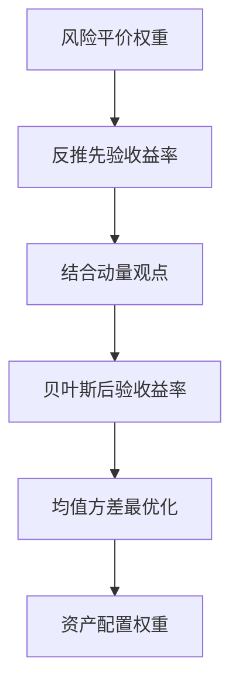

# 资产配置风险平价与BL模型

## Abstract / 摘要

[[方正金工]]宋家骥、严佳炜在2019年12月提出将[[风险平价]]（Risk Parity）与[[black-litterman模型|Black-Litterman模型]]融合的资产配置策略（RPBL）。核心创新：以风险平价权重替代传统市值权重作为B-L模型的先验（解决A股市值波动大、新股频发的问题），叠加短期动量作为观点，通过跟踪误差约束控制风险。回测2006-2019年，四资产RPBL策略年化14.67%，最大回撤仅-6.82%。

## Key Facts / 关键事实

- **模型融合**：风险平价（先验权重）→ Black-Litterman（结合动量观点）→ 均值方差最优化
- **先验改进**：传统B-L用市值权重作先验，A股不适用；改用风险平价权重有效分散风险
- **观点信号**：过去6个月累计收益率作为动量观点
- **参数**：18个月窗口估计协方差矩阵，月频调仓
- **股债RPBL策略**：年化10.14%，最大回撤-6.86%
- **四资产RPBL策略**（股票+债券+商品+海外）：年化14.67%，最大回撤-6.82%
- **低波动版本RPBL(1%)**：四资产年化6.60%，波动率3.53%，夏普1.87
- 14年回测期内13年正收益（股债版），四资产版连续14年正收益

## Methodology / 方法论

### RPBL框架

1. **风险平价先验**：使每类资产对组合总风险的贡献相等，反推出先验收益率 $\Pi = \delta \Sigma \omega_{RP}$
2. **动量观点**：过去6个月累计收益率作为 $Q$，观点矩阵 $P$ 为对角阵
3. **贝叶斯合成**：后验收益率 $\mu_{BL} = [(\tau\Sigma)^{-1} + P^T\Omega^{-1}P]^{-1}[(\tau\Sigma)^{-1}\Pi + P^T\Omega^{-1}Q]$
4. **跟踪误差约束**：控制后验权重与风险平价权重的偏离带来的额外波动率

### 关键设计

- 协方差用18个月滚动窗口估计（相对收益率更稳定）
- 跟踪误差约束可调（1%/2%/5%/8%/无约束），夏普比率随约束放松而下降
- 四资产：中证800（股票）、中债综合指数（债券）、南华商品指数（商品）、标普500（海外）

## Model Comparison / 模型对比

| 策略 | 年化收益 | 年化波动 | 最大回撤 | 夏普比率 |
|------|----------|----------|----------|----------|
| 股债等权 | 6.93% | 7.98% | -19.28% | 0.87 |
| 股债风险平价 | 5.03% | 2.80% | -2.98% | 1.79 |
| 股债RPBL(1%) | 5.75% | 3.12% | -4.05% | 1.84 |
| 股债RPBL | 10.14% | 7.80% | -6.86% | 1.30 |
| 四资产风险平价 | 5.42% | 3.20% | -4.23% | 1.70 |
| 四资产RPBL(1%) | 6.60% | 3.53% | -4.94% | 1.87 |
| 四资产RPBL | 14.67% | 10.42% | -6.82% | 1.41 |

## Related Pages / 关联页面

- [[风险平价]] — 先验权重的基础模型
- [[black-litterman模型]] — 贝叶斯框架
- [[方正金工]] — 来源团队
- [[价值指数投资]] — 同团队的Smart Beta研究
- [[大小盘风格轮动]] — 同团队的风格轮动研究

## Evidence / 原文证据摘录

> "风险平价策略虽然能够有效控制策略的波动，但相应的收益率却比较低。"

> "在B-L模型中，只有观点涉及到的资产权重才会发生变化，不涉及到的资产权重不会发生变化。"

> "传统B-L模型以各资产的市值权重作为先验权重并反推出资产的先验收益率，但这一指标在国内金融市场中可能意义不大。"

## Claims to Verify / 待核实问题

- RPBL策略2019年后（尤其是2020年疫情、2022年股债双杀）的表现？
- 18个月窗口和6个月动量参数是否过拟合？
- 跟踪误差约束"夏普比率随约束放松而下降"的结论在更长时间内是否稳健？

## Sources / 来源

- 原始报告：《资产配置研究系列之一：通过风险平价与Black-Litterman打造稳定收益组合》2019.12.2 宋家骥、严佳炜

## Notes / 笔记

<!-- human:start -->
<!-- human:end -->
