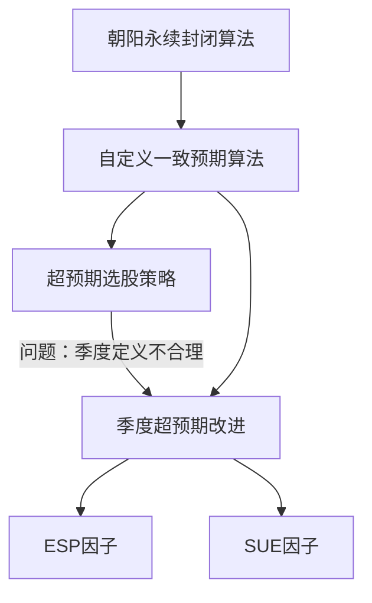

# 业绩超预期因子体系

## Overview / 概述

本页综合华创金工团队 2018 年的两篇系列报告，梳理业绩超预期因子从概念到策略到因子的完整演进。第一篇报告（2018.4）提出了自定义一致预期算法和超预期选股策略；第二篇报告（2018.6）针对季度超预期定义的缺陷进行改进，构建了 ESP 和 SUE 两个连续因子。

## Key Findings / 核心发现

### 演进脉络

### 两代超预期定义对比

| 维度 | 第一代（2018.4） | 第二代（2018.6） |
|------|------------------|------------------|
| 年度超预期 | 公布值 vs 一致预期 | 同左 |
| 季度超预期 | 累计同比增速 vs 一致预期增长率 | 季报前后分析师预测变化 |
| 问题 | 实质是买入同比大增股 | 更合理但覆盖度受限于分析师报告 |
| 输出 | 选股策略（6 条件筛选） | 连续因子（ESP/SUE） |
| 调仓 | 月度 | 月度 |

### 因子表现对比

| 指标 | ESP 最优组 | SUE 最优组 |
|------|-----------|-----------|
| 沪深 300 超额 | 17.25% | 20.0% |
| 沪深 300 IR | 1.44 | 1.87 |
| 中证 500 超额 | 18.90% | 19.18% |
| 中证 500 IR | 1.33 | 1.28 |

### A 股 PEAD 特征

1. **正向与负向非对称**：超预期股票显著跑赢，但低于预期股票不显著跑输 — [[季度超预期再构建及业绩超预期因子分析]]
2. **分析师偏乐观**：大部分超预期值为负，分析师在下调预测时仍维持推荐态度 — [[一致预期及业绩超预期深度解析]]
3. **信号衰减快**：一个月后信号基本失效 — [[季度超预期再构建及业绩超预期因子分析]]
4. **区分度集中在高端**：超预期幅度 >10% 才有明显超额收益 — [[一致预期及业绩超预期深度解析]]

## Tensions and Contradictions / 分歧与矛盾

- **第一代策略的隐含假设**：其他季度以同样比例增长，这在事实上不成立，导致策略可能买入的只是同比大增股而非真正超预期
- **因子覆盖度 vs 及时性**：等待更多分析师报告可提高覆盖度，但会错失交易机会；提前计算覆盖度不足，但信号更及时
- **SUE 在中证 500 的 IR 反而低于 ESP**（1.28 vs 1.33），说明标准化不一定在所有样本中都有改善

## Emerging Thesis / 初步结论

业绩超预期因子在 A 股市场有效，但有以下注意点：

1. SUE 因子整体优于 ESP，建议优先使用
2. 适合做多超预期股票，做空端效果有限
3. 需月度调仓以捕捉快速衰减的信号
4. 因子覆盖度是实际应用的瓶颈（沪深 300 仅 68%）
5. 2018 年后的有效性尚需验证

## Related Pages / 关联页面

- [[业绩超预期]] — 核心概念
- [[一致预期]] — 算法基础
- [[esp因子]] — 第一代因子
- [[sue因子]] — 第二代因子
- [[盈余惯性]] — 理论基础
- [[华创金工]] — 研究团队

## Sources / 来源

- [[一致预期及业绩超预期深度解析]]
- [[季度超预期再构建及业绩超预期因子分析]]

## Open Questions / 未解问题

- 2018 年后（特别是注册制改革后）因子是否持续有效？
- 分析师行为在全面注册制下是否有结构性变化？
- 能否结合技术面/量价信号提升因子覆盖度？
- ESP/SUE 因子与其他因子（如动量、价值）的相关性如何？

## Notes / 笔记

<!-- human:start -->
<!-- human:end -->
