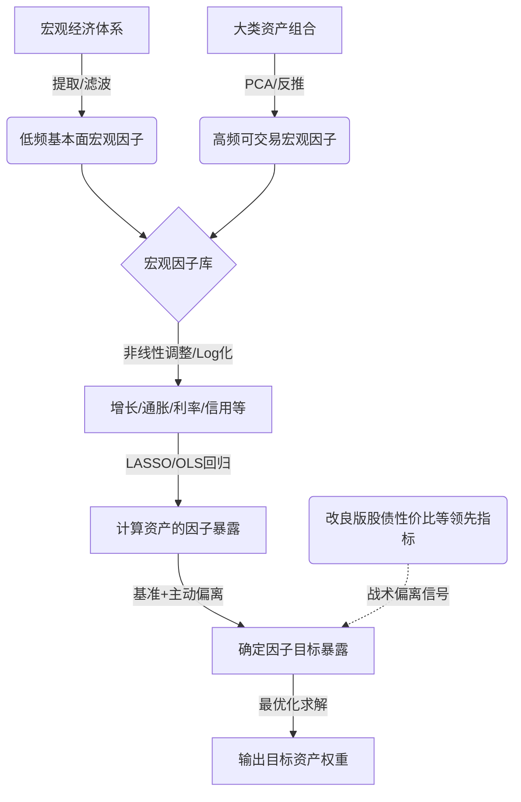

# 宏观因子模型

## Overview / 概述

本综合分析旨在梳理并重构[[宏观因子模型]]在现代多资产投资中的理论框架与应用实践。传统的[[资产配置]]往往停留在资产表层或风险表层，容易受制于资产内部逻辑的黑箱效应与尾部风险共振。将上述来源综合来看，我们可以清晰地看到一条从“资产配置”向“因子配置”演进的完整脉络：从确立宏观因子框架、解构大类资产回报，到优化底层因子（如无风险利率与股权风险溢价）的非线性建模，最终落脚于因子目标暴露与投资组合权重的求解。将这些研究放在一起，能够为量化投资者提供一个闭环的、从宏观研究到交易落地的系统性宏观因子配置指南。

## Key Findings / 核心发现

1. **因子配置是资产配置演进的必然方向**：大类资产配置模型经历了从资产配置（如[[均值方差模型]]、[[black-litterman模型]]）、风险配置（如[[风险平价]]）到因子配置的三个发展阶段。因子配置能够穿透资产表象，把握驱动价格变动的底层逻辑，实现真正意义上的风险分散。[[大类资产配置体系简析-大类资产配置量化模型研究系列之一]]
2. **六大核心宏观因子可高效解构资产回报**：通过构建增长、存货、信贷、通胀、名义利率、期限六个宏观因子，利用OLS回归可解释国内大类资产40%-80%的回报。其中，名义利率因子对A股/债券解释力最高，而存货和通胀因子对大宗商品解释力最高。[[基于宏观因子的大类资产回报解构]]
3. **宏观因子具备显著的低相关性与周期轮动特征**：六大宏观因子之间的相关系数绝对值平均仅为0.12，不存在明显共线性。同时，不同宏观周期下资产的驱动因子存在明显切换（如A股核心驱动在2008-2011年为名义利率，2011-2015年为增长）。[[基于宏观因子的大类资产配置框架-大类资产配置量化模型研究系列之四]] [[基于宏观因子的大类资产回报解构]]
4. **传统风险平价策略在因子层面的暴露存在缺陷**：传统的[[风险平价]]策略看似均衡了资产风险，但在宏观因子层面却过多暴露于利率因子（贡献高达54.19%的风险），并未实现真正的因子风险平价。[[基于宏观因子的大类资产配置框架-大类资产配置量化模型研究系列之四]]
5. **底层宏观变量的非线性重构能显著提升预测效能**：在构建宏观因子时，传统线性处理无法准确反映低利率环境下无风险利率对风险资产的非线性影响。引入log函数进行非线性调整，并重构国内市场的无风险利率（“中票AA+ 85% + 美债10Y 15%”），能比传统指标在历史关键拐点更早、更准确地发出配置信号。[[如何使用改良版股债性价比指标-资产配置思考系列之五]]

## Tensions and Contradictions / 分歧与矛盾

通过对不同来源的比较，可以发现宏观因子模型在落地实践中存在以下分歧与矛盾：

1. **因子提取与频率处理的的方法论分歧**：
   - [[基于宏观因子的大类资产回报解构]] 侧重于低频基本面数据的处理，采用[[动态因子模型]]（DFM）和HP滤波来提取趋势，并依赖7290次[[遍历性回归]]来确定因子的滞后阶数（如信贷因子滞后一期）。
   - [[基于宏观因子的大类资产配置框架-大类资产配置量化模型研究系列之四]] 则为了满足投资实操需求，侧重于通过资产组合反向构建**高频宏观因子**，并使用基于先验信息的[[lasso回归]]结合Bootstrap计算因子暴露。两者在“自上而下提取宏观信号”与“自下而上合成高频因子”的路径上存在明显差异。
2. **名义利率/无风险利率代理变量的选择矛盾**：
   - 在[[基于宏观因子的大类资产回报解构]]中，名义利率因子被简单定义为“广义无风险利率与通胀之差”。
   - 然而[[如何使用改良版股债性价比指标-资产配置思考系列之五]]明确指出，单一国债利率无法真实反映国内市场行为，特别是低利率环境下的非线性影响会导致指标失效。这表明早期的宏观因子模型在核心变量（无风险利率）的界定上存在简化偏差，需要引入更复杂的加权结构与非线性函数进行修正。
3. **模型解释力的时间稳定性分歧**：
   - [[基于宏观因子的大类资产配置框架-大类资产配置量化模型研究系列之四]] 强调宏观因子能够稳定解释资产价格变动并规避尾部风险。
   - 但[[基于宏观因子的大类资产回报解构]]的实证承认了宏观因子解释力的分化：近年来对沪深300、港股、债券的解释力上升，但对中证500和全A的解释力却在下降。这暗示固定的宏观因子集可能无法持续覆盖成长股或中小盘股的定价逻辑。

## Emerging Thesis / 初步结论

基于现有证据，我们提出以下初步结论（部分为试探性推论）：

1. **宏观因子配置的闭环框架已确立（高确信度）**：成熟的宏观因子配置需经历“因子选取与提取 -> 资产因子暴露测算 -> 因子目标偏离设定 -> 资产权重最优化求解”四个标准化步骤。
2. **非线性建模是宏观因子进化的关键方向（试探性结论）**：传统线性多因子模型（如OLS回归）在极端宏观环境（如低利率）下会失效。未来[[宏观因子模型]]必须内嵌非线性机制（如Log调整）和动态市场代理变量，以真实捕捉[[权益风险溢价]]的边际变化。
3. **因子组合的构建需兼顾解释力与可交易性（试探性结论）**：纯基本面宏观因子（如M2、工业增加值）具有强经济学逻辑，但频率低、滞后性强；通过资产反推的高频因子具有更好的实时交易指导意义。最优解可能是将低频基本面因子作为长期战略配置（SAA）的锚，将高频因子和改良指标（如改良版股债性价比）用于战术资产配置（TAA）的偏离调整。

以下为宏观因子模型在资产配置中的闭环流程示意：

在因子暴露与资产权重的数学转化上，通常采用优化的LASSO回归计算暴露矩阵 $\beta$，并通过最优化框架求解权重 $W$。目标函数可表示为：

$$ \min_{W} \frac{1}{2} (W - W_{bench})^T \Sigma (W - W_{bench}) + \lambda \| W \|_1 $$

约束条件为因子暴露匹配目标暴露：
$$ B^T W = B_{target} $$

其中，$W$ 为目标资产权重，$W_{bench}$ 为基准权重，$\Sigma$ 为资产收益率的协方差矩阵，$B$ 为资产的因子暴露矩阵，$B_{target}$ 为结合主观观点设定的目标因子暴露。

## Related Pages / 关联页面

- [[资产配置]] — 宏观因子模型的上层应用场景，涵盖SAA与TAA。
- [[因子暴露]] — 连接宏观抽象因子与具体可交易资产的核心桥梁。
- [[动态因子模型]] — 处理低频、多指标宏观经济数据的核心降维技术。
- [[lasso回归]] — 处理高维因子共线性、结合先验信息压缩资产权重的方法。
- [[权益风险溢价]] — 衡量股债相对价值的核心宏观因子，受无风险利率非线性影响。
- [[风险平价]] — 传统的风险配置模型，但在宏观因子维度存在“利率风险过度集中”的缺陷。

## Sources / 来源

- [[基于宏观因子的大类资产回报解构]]
- [[基于宏观因子的大类资产配置框架-大类资产配置量化模型研究系列之四]]
- [[大类资产配置体系简析-大类资产配置量化模型研究系列之一]]
- [[如何使用改良版股债性价比指标-资产配置思考系列之五]]

## Open Questions / 未解问题

- **非线性扩展的普适性**：除了[[权益风险溢价]]（股债性价比）指标外，其他宏观因子（如信贷因子、存货因子）在特定周期下是否也存在对资产价格的非线性影响？如何普适性地引入非线性模型（如机器学习算法）来重构宏观因子？
- **因子时变性与解释力衰减**：宏观因子对中证500等中小盘资产的解释力近年来出现下降，这是否意味着传统的六因子模型遗漏了关键的“流动性因子”或“情绪因子”？如何动态调整因子库以适应产业结构转型？
- **高频宏观因子的超额收益来源**：通过资产反推构建的高频宏观因子组合，其产生的超额收益在多大程度上来自于宏观风险溢价，又在多大程度上来自于资产间的估值错杀和动量效应？
- **尾部风险的对冲效能**：在极端黑天鹅事件（如流动性危机）中，基于历史LASSO回归测算的因子暴露矩阵往往会失效，如何引入体制转换机制来动态调整因子目标暴露？

## Notes / 笔记
（留空）

## Notes / 笔记

<!-- human:start -->
<!-- human:end -->

