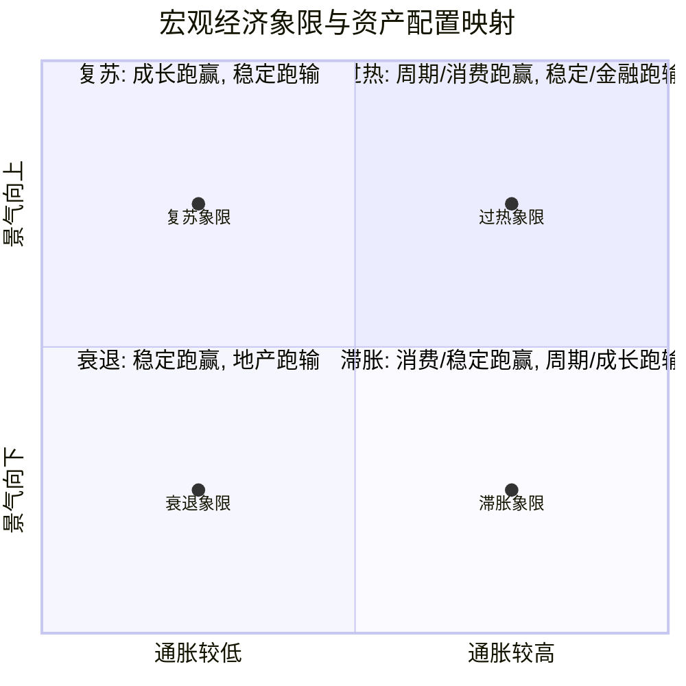
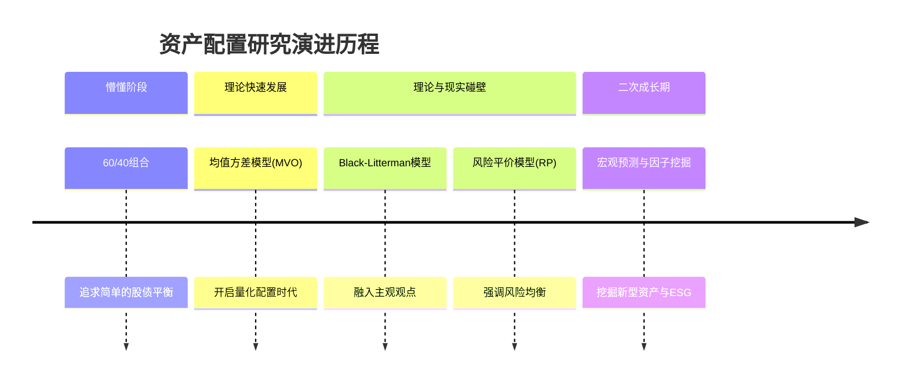

# 资产配置

## Overview / 概述

本综合分析旨在探讨量化投资领域中**资产配置**的多维度方法论与实践演进。传统的资产配置往往依赖于静态的股债固定比例（如经典的60/40组合），但在宏观经济周期切换加剧、市场波动率上升的背景下，静态配置面临极大挑战。

将上述四个来源综合来看，我们可以清晰地勾勒出一条从**长期战略配置**到**宏观因子定性象限**，再到**量化趋势打分**与**微观波动率调整**的完整资产配置演进路径。这四个来源分别代表了资产配置研究的不同切面：[[国君配置资产配置研究进入二次成长期长期配置研究思考与展望]]提供了宏观战略与大类视野的“道”；[[板块配置轮盘之初探]]和[[基于宏观指标趋势的资产配置策略]]提供了自上而下连接宏观与资产的“法”；而[[5-5波动率分析框架下的风格配置-利用均值方差和风险平价模型实践主动风格轮动]]则深入到微观风格与模型参数调整的“术”。将它们放在一起，有助于构建一个立体、动态且具备可操作性的现代资产配置知识架构。

## Key Findings / 核心发现

1. **资产配置研究已跨越经典理论瓶颈，进入“宏观预测与因子挖掘”的二次成长期**。传统模型如[[均值方差模型]]（MVO）和[[风险平价]]（RP）面临理论与现实碰壁的困境，现代资产配置更强调宏观因子的驱动与ESG、新型资产等维度的引入（来源：[[国君配置资产配置研究进入二次成长期长期配置研究思考与展望]]）。
2. **宏观经济状态可以成功映射到大类资产及权益风格的超额收益上**。通过构建宏观景气因子与通胀因子，可以将经济周期划分为四个象限，并据此总结出胜率较高的板块轮动规律（来源：[[板块配置轮盘之初探]]）。
3. **单一宏观指标的均线趋势对资产收益具有显著区分度**。利用PMI、CPI等宏观指标的趋势信号进行T检验筛选，并据此动态调整资产权重，能够大幅跑赢固定比例的基准组合（年化收益从6.06%提升至13.42%）（来源：[[基于宏观指标趋势的资产配置策略]]）。
4. **在经典量化模型中引入主观波动率调整系数，能显著改善配置绩效**。基于经济周期、拥挤度等5个维度对波动率进行主动预判并调整MVO和RP模型的输入参数，不仅提升了收益率，还改善了夏普比率（来源：[[5-5波动率分析框架下的风格配置-利用均值方差和风险平价模型实践主动风格轮动]]）。

## Tensions and Contradictions / 分歧与矛盾

在深入对比各来源时，可以发现不同研究框架在宏观因子构建与周期判断上存在显著分歧：

1. **通胀因子的构建逻辑存在差异**：
   - [[板块配置轮盘之初探]]在构建通胀因子时，采用CPI和PPI以8:2比例加权，强调贴近居民端消费价格（CPI占绝对主导）。
   - [[5-5波动率分析框架下的风格配置-利用均值方差和风险平价模型实践主动风格轮动]]在构建“滞胀指数”时，使用的是CPI和PMI的差值（本质是价格与实体景气的剪刀差）。
   - [[基于宏观指标趋势的资产配置策略]]则直接将单一宏观指标（如CPI、M2）的历史均线作为独立信号，不进行复合因子构建。这反映了量化研究中对宏观变量“降维”与“升维”的不同哲学。

2. **对成长风格在特定宏观阶段表现的矛盾结论**：
   - [[板块配置轮盘之初探]]统计规律显示，在**复苏**象限中，成长风格显著跑赢；而在**滞胀**象限中，成长风格显著跑输。
   - 然而，[[5-5波动率分析框架下的风格配置-利用均值方差和风险平价模型实践主动风格轮动]]在2022年初（当时宏观环境正被普遍定义为滞胀或衰退期）指出，成长风格交易依然十分拥挤，波动率调整比例最高（上调15.4%），建议向低风险特征的金融和稳定风格切换。这表明，基于历史统计的“象限规律”在面对现实中由交易拥挤度导致的“波动率异变”时，可能会发出冲突信号。

## Emerging Thesis / 初步结论

基于上述证据，提出以下初步结论：

1. **宏观量化是打通战略与战术资产配置的关键桥梁**。无论是[[板块配置轮盘之初探]]的四象限，还是[[基于宏观指标趋势的资产配置策略]]的均线信号，都证明了纯定性的宏观研判可以被转化为定量、可回测的系统化规则。
2. **经典模型需要“主动化”改造**。无论是[[black-litterman模型]]融入主观观点，还是对[[均值方差模型]]和[[风险平价]]模型输入调整后的波动率预期，纯被动的量化模型已难以适应复杂市场，未来的资产配置必然是“宏观主观逻辑 + 量化客观执行”的有机结合。
3. **（试探性结论）长周期变量（如人口老龄化、通胀周期重启）正在重塑资产配置的有效边界**。随着全球化退潮，传统股债相关性上升，必须通过引入新型低相关性资产（如数字货币、可再生能源基础设施）和[[esg投资]]框架来重塑组合的防御性。

## Mermaid 图表展示

### 宏观四象限与风格/板块轮动规律
以下图表展示了基于景气与通胀因子的资产配置映射规律（数据来源：[[板块配置轮盘之初探]]）：

### 资产配置研究演进阶段

## 数学公式与模型表达

在[[5-5波动率分析框架下的风格配置-利用均值方差和风险平价模型实践主动风格轮动]]中，核心在于对传统模型输入的波动率进行主动调整。风格资产的实际预期波动率 $\sigma_{adj}$ 可表示为：

$$ \sigma_{adj} = \sigma_{hist} \times (1 + \delta_{baseline}) \times (1 + \delta_{style}) $$

其中：
- $\sigma_{hist}$ 为历史波动率。
- $\delta_{baseline}$ 为全市场基准波动率上调比例（如统一上调 20%）。
- $\delta_{style}$ 为基于5维度稳定性评分的风格波动率调整系数（如成长风格上调 15.4%，金融风格上调 8.6%）。

在[[板块配置轮盘之初探]]中，通胀因子 $Factor_{inflation}$ 的构建公式为：

$$ Factor_{inflation} = Filter(0.8 \times CPI + 0.2 \times PPI) $$

其中 $Filter(\cdot)$ 代表滤波处理函数，用于提取趋势项。

## Related Pages / 关联页面

- [[宏观指标趋势]] — 基于均线信号动态调整权重的具体方法论
- [[板块配置轮盘]] — 宏观四象限与行业/风格轮动的映射规律
- [[5-5波动率分析框架]] — 结合多维度的波动率主动调整机制
- [[均值方差模型]] / [[风险平价]] / [[black-litterman模型]] — 资产配置的核心量化工具
- [[esg投资]] — 重塑投资流程及降低组合下行风险的新范式
- [[风格波动率调整系数]] — 连接主观市场判断与量化模型输入的关键参数

## Sources / 来源

- [[基于宏观指标趋势的资产配置策略]]
- [[国君配置资产配置研究进入二次成长期长期配置研究思考与展望]]
- [[5-5波动率分析框架下的风格配置-利用均值方差和风险平价模型实践主动风格轮动]]
- [[板块配置轮盘之初探]]

## Open Questions / 未解问题

- **宏观因子的时效性钝化问题**：随着越来越多的机构采用PMI、CPI等公开宏观数据构建均线或四象限策略，这类策略的超额收益是否会因交易拥挤而逐渐消失？
- **极端通胀下的模型失效风险**：在遇到如2022年全球性的极端通胀（通胀因子远超历史均值）时，基于历史协方差矩阵的[[均值方差模型]]和[[风险平价]]模型是否还能通过简单的波动率上调来应对？
- **新型资产的数据匮乏**：[[国君配置资产配置研究进入二次成长期长期配置研究思考与展望]]提到配置数字货币、元宇宙等新型低相关性资产，但这些资产缺乏长周期历史数据，如何在MVO或B-L模型中对其预期收益率和协方差矩阵进行合理估计？

## Notes / 笔记
(留空)

## Notes / 笔记

<!-- human:start -->
<!-- human:end -->

