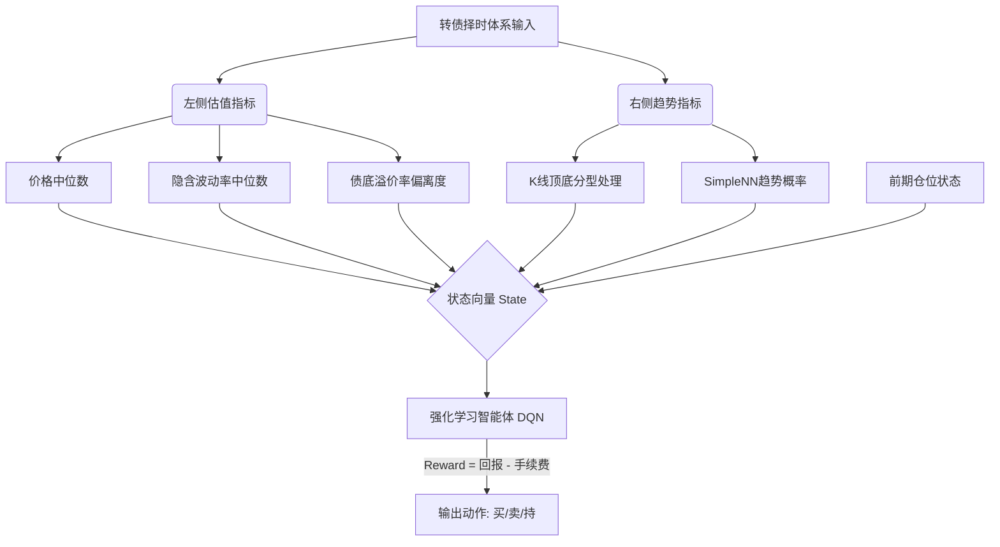

# 转债择时体系

## Overview / 概述

[[转债择时体系]]是量化投资中针对[[可转债]]这一非线性资产进行仓位管理与买卖点优化的核心框架。由于可转债兼具债底保护与期权弹性，传统的线性预测模型往往难以适应其复杂的市场环境。本综合分析整合了中金固收系列研报及实战代码，旨在解决以下核心问题：如何有效结合**左侧估值**与**右侧趋势**？如何克服传统阈值规则的滞后性？以及如何利用[[强化学习]]处理交易成本与长期收益的平衡？

将这四篇来源放在一起看，能够完整勾勒出转债择时从**基础指标构建**、到**机器学习赋能**、再到**左右结合逻辑闭环**的演进路径，为量化开发者提供一套兼具理论深度与工程落地（python实现）的系统性指南。

## Key Findings / 核心发现

1. **百元溢价率是中长期估值锚**：在众多估值指标中，[[百元溢价率]]是决定转债中长期（120日以上）回报的最关键指标，26%是其重要的牛熊分界点。此外，[[甜点转债数]]对持有风险高度敏感（中位价格>127元且甜点数<55个时风险极高）。[[中金转债-择时体系1-这些指标怎么看-及python实现]]
2. **情绪与结构指标有效预警过热**：[[弱势品种表现指标]]能有效衡量资金推动下的市场过热，当数值达到2.5%以上时具有显著的负面预期。[[中金转债-择时体系1-这些指标怎么看-及python实现]]
3. **强化学习优于传统监督学习**：在转债择时中，[[强化学习]]（如DQN）通过输出“动作建议”而非具体收益率，有效避免了传统最小二乘法预测接近0的窘境。同时，在状态向量中加入“前期仓位”，能约束频繁交易，使模型更符合真实交易场景。[[中金转债-择时体系2-强化学习的逐步实现]]、[[左右开弓-择时策略的逻辑闭环与python建议]]
4. **右侧趋势的稀缺与程序化识别**：转债市场趋势一旦形成，延续概率远大于逆转（常伴随4倍Sigma波动）。通过K线包含关系处理、顶底分型识别（[[k线形态学]]），结合[[神经网络]]（SimpleNN）和MACD等特征，可以有效程序化划分并预测趋势状态。[[打造趋势分析工具-何时判定右侧-转债择时体系-三]]
5. **左右开弓的闭环模型**：最优的实战策略是精简左侧指标（价格中位数、[[隐含波动率]]中位数、[[债性转债债底溢价率偏离]]），并直接引入右侧趋势模型值作为代理变量，通过强化学习输出最终的交易信号。[[左右开弓-择时策略的逻辑闭环与python建议]]

## Tensions and Contradictions / 分歧与矛盾

1. **指标维度的选择：繁复全面 vs 精简长效**
   - 在系列第一篇中，作者列举了多达9个维度的指标（包含估值、情绪、结构、期权定价等），倾向于多维度全景扫描。[[中金转债-择时体系1-这些指标怎么看-及python实现]]
   - 然而在最终的闭环模型中，作者明确指出应剔除繁杂指标，仅保留“价格中位数、隐含波动率中位数、债底溢价率偏离度”三个长效且无缺失的左侧指标，以防止模型过拟合并降低维度灾难。[[左右开弓-择时策略的逻辑闭环与python建议]]
2. **模型可解释性：决策树的白盒 vs 神经网络/RL的黑盒**
   - 早期文章倾向于使用最大深度为3的[[决策树择时模型]]，强调“以客观规律取代主观直觉”，且具备极高的白盒可读性。[[中金转债-择时体系1-这些指标怎么看-及python实现]]
   - 后续引入PyTorch和[[强化学习]]后，模型走向黑盒化。虽然作者提出使用Captum等可解释性分析工具来归因黑盒决策，但这表明在处理复杂非线性时，研究者在“可读性”与“模型表达力”之间妥协于后者。[[中金转债-择时体系2-强化学习的逐步实现]]
3. **左侧指标的先天缺陷与右侧模型的定位**
   - 矛盾点在于：左侧估值指标（如甜点数、百元溢价率）往往过早发出信号，导致严重的踏空或时间成本损耗。[[中金转债-择时体系2-强化学习的逐步实现]]
   - 解决方案是对右侧模型的功能进行降级：明确指出**不依赖右侧模型进行预判**，而是仅将其用于“划分结构、确认趋势”，作为左侧信号的补充和过滤器。[[左右开弓-择时策略的逻辑闭环与python建议]]

## Emerging Thesis / 初步结论

基于上述来源，转债量化择时的有效范式可以概括为：**“左侧定空间，右侧定时间，强化学习做统筹”**。

1. **试探性结论：非线性资产的线性解法是失效的**。转债由于含有期权属性，其收益分布呈现严重的右偏或左偏。试图用传统的时间序列模型（如ARIMA或简单OLS）预测收益率是死路一条。将目标转化为“状态分类”或通过强化学习输出“离散动作（买/卖/持）”是更合理的路径。
2. **高确信度结论：交易成本是择时模型的生死线**。不考虑手续费的回测都是伪逻辑。强化学习通过在Reward函数中引入 $Reward = r_{t+1} - Cost$，并在状态空间 $S_t$ 中加入前期仓位，是应对这一问题的最佳实践。
   
   $$ R_t = \sum_{k=0}^{\infty} \gamma^k r_{t+k+1} - \sum_{k=0}^{\infty} \gamma^k C(action_{t+k}) $$

3. **试探性结论：趋势的量化定义必须剥离主观**。通过缠论中的“包含关系处理”与“顶底分型”，辅以长周期MACD，可以将主观的“看图说话”转化为机器可读的离散状态（如状态值突破0.5视为右侧确立）。

## Related Pages / 关联页面

- [[百元溢价率]] — 转债中长期估值的最核心锚定指标
- [[强化学习]] — 解决转债非线性收益与交易成本统筹的核心算法
- [[趋势跟踪]] — 右侧确认的核心逻辑，避免左侧估值过早入场
- [[隐含波动率]] — 衡量转债期权价值高低的左侧精简指标
- [[决策树择时模型]] — 早期用于多指标混合的白盒可解释方案
- [[转债市场情绪指标]] — 用于辅助判断市场过热或极寒的辅助工具

## Sources / 来源

- [[中金转债-择时体系1-这些指标怎么看-及python实现]]
- [[中金转债-择时体系2-强化学习的逐步实现]]
- [[打造趋势分析工具-何时判定右侧-转债择时体系-三]]
- [[左右开弓-择时策略的逻辑闭环与python建议]]

## Open Questions / 未解问题

- **微调机制的边界**：在强化学习模型中，针对新样本数据提出“固定深层网络、微调浅层网络”以防过拟合。但在实际滚动训练中，多长的窗口期最适合转债市场的周期轮动？是否需要引入动态权重？
- **黑天鹅事件的降维**：右侧趋势模型基于历史K线形态，当遇到监管政策根本性转变（如转债交易新规出台）导致的流动性骤缩时，模型如何快速适应并止损？
- **多因子归因**：在Captum等工具解释黑盒模型时，左侧估值与右侧趋势特征的具体权重分布随市场状态（牛/熊/震荡）的演变规律是什么？

## Notes / 笔记

## Notes / 笔记

<!-- human:start -->
<!-- human:end -->

